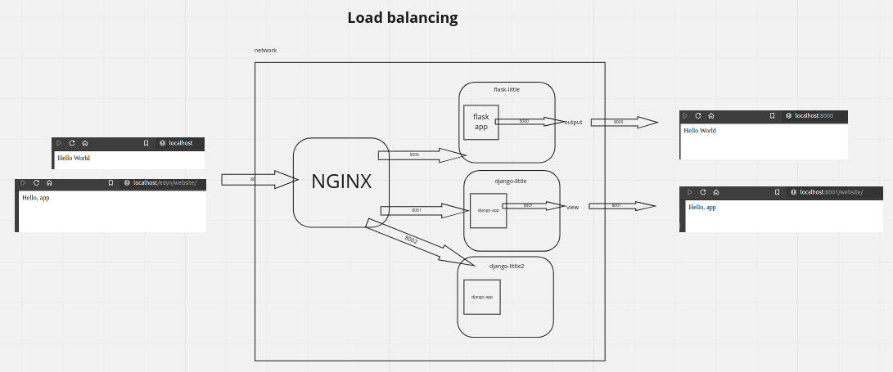

# LOAD BALANCING

- Distributes client requests or network load efficiently across multiple servers
- Ensures high availability and reliability by sending requests only to servers that are online
- Provides the flexibility to add or subtract servers as demand dictates

## What are we going to do here?



### 1) Flask App

```bash
vim app.py
```

```python
from flask import Flask

app = Flask(__name__)

@app.route('/')
def hello_world():
    return 'Hello Flask'
```

```bash
python3 -m flask run --host=0.0.0.0
```

### 2) Flask + Docker

```bash
pip3 freeze > requirements.txt
```

```bash
vim Dockerfile
```

```yaml
FROM python:3.8-slim-buster

EXPOSE 5000

WORKDIR /app

COPY requirements.txt /app

RUN pip install -r requirements.txt --no-cache-dir

CMD ["python3", "-m", "flask", "run", "--host=0.0.0.0"]
```

```bash
├── flask-app
│   ├── app.py
│   ├── Dockerfile
│   ├── __pycache__
│   └── requirements.txt

docker build --tag flask-app .

docker network create net-edyn

docker run --rm --name flask-little --network net-edyn flask-app
```

### 3) Flask + Docker + Nginx

```bash
vim nginx/default.conf

server {
    location "/" {
        proxy_pass http://flask-little:5000/;
    }
    listen 80;
}

docker run --rm --name some-nginx -p 80:80 -v $(pwd)/nginx:/etc/nginx/conf.d --network net-edyn nginx
```

### 4) Django + Docker

```bash pip install django
django-admin startproject mysite
python manage.py startapp website
```

```bash
vim website/views.py
```

```python
from django.http import HttpResponse

def index(request):
    return HttpResponse("Hello Django")
```

```bash
vim website/urls.py
```

```python
from django.urls import path
from . import views

urlpatterns = [
    path('', views.index, name='index'),
]
```

```bash
vim mysite/urls.py
```

```python
from django.contrib import admin
from django.urls import include, path

urlpatterns = [
    path('website/', include('website.urls')),
    path('admin/', admin.site.urls),
]
```

```bash
pip freeze | grep Django > requirements.txt
vim Dockerfile
```

```yaml
FROM python:3.8-slim-buster

EXPOSE 8001 8002

WORKDIR /app

COPY requirements.txt /app

RUN pip install -r requirements.txt --no-cache-dir

ENTRYPOINT ["python3"]

CMD ["manage.py", "runserver", "0.0.0.0:8001"]
```

```bash
└── mysite
    ├── db.sqlite3
    ├── Dockerfile
    ├── manage.py
    ├── mysite
    ├── requirements.txt
    └── website

docker build --tag djangp-app .

docker run --rm --name django-little -p 8002:8001 --network net-edyn django-app
```

### 4) Django + Docker + Nginx

```bash
docker run --rm --name django-little --network net-edyn django-app
```

```bash
vim nginx/default.conf

server {
    location "/" {
        proxy_pass http://flask-little:5000/;
    }
    location "/django" {
        proxy_set_header Host $host;
        proxy_pass http://django-little:8001/;
    }
    listen 80;
}

docker exec -it nginx-some nginx -s reload
```

### 4) Django + Docker + Nginx + Load Balancing

```bash
docker run --rm --name django-little2 --rm --network net-edyn djangp-app manage.py runserver 0.0.0.0:8002
```

```bash
vim nginx/default.conf

upstream edyn-api {
    server django-little:8001;
    server django-little2:8002;
}

server {
    location "/" {
        proxy_pass http://flask-little:5000/;
    }
    location "/django" {
        proxy_set_header Host $host;
        proxy_pass http://edyn-api/;
    }
    listen 80;
}

docker exec -it nginx-some nginx -s reload
```
